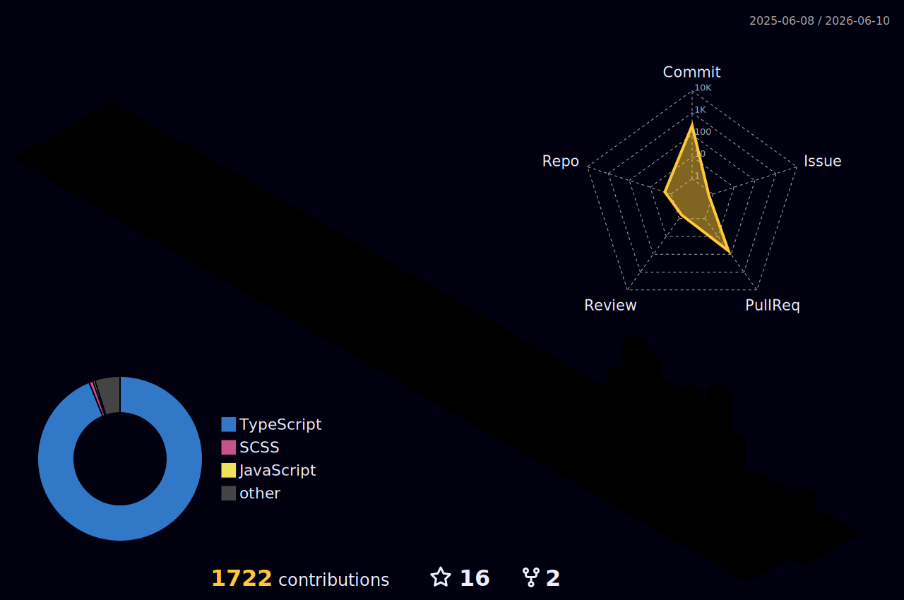

 

 
<h1 align = "justify"> Hi 👋, I am Gabriel Cintra</h1>

Front-end Developer, Tea and Coffee lover, Javascript and SPA fan, Performance curious. Currently working with <strong>VTEX</strong>.

I currently work at [Jüssi](https://jussi.com.br/) | [Brastemp](https://www.brastemp.com.br/) | [Consul](https://www.consul.com.br/) | [CompraCerta](https://www.compracerta.com.br/) | [Whirlpool](https://www.whirlpool.com.br)

I'm learning at the moment **ReactJS**

#### 🤛🎮 Group and Games

<!--  -->

#### 🚀 Core VTEX Stack

#### 💻 Frontend

#### ⚙ Backend & Tooling

#### 🔧 Version Control

#### 📋 Project Management

<!--  -->
<!--  -->
<!--  -->
<!--  -->
<!--  -->

#### ⚡ GitHub Stats

  
<!--  -->

<!-- -->

<!-- 

  

 -->

