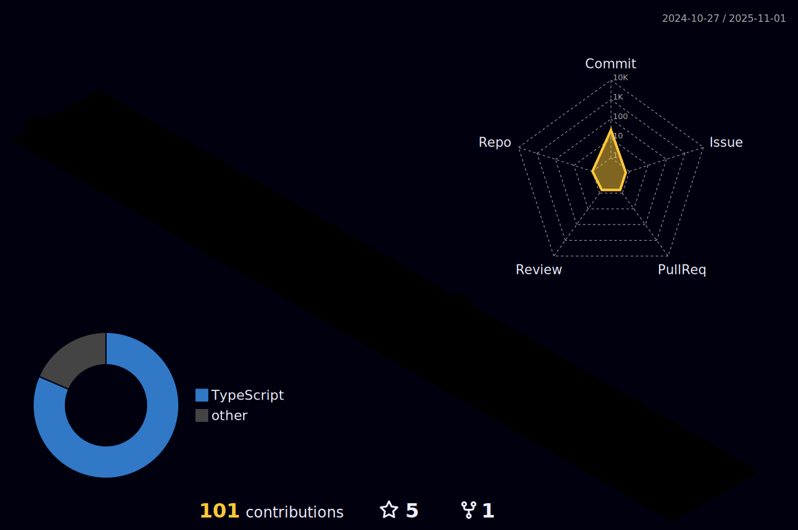

 

 
<h1 align = "justify"> Hi 👋, I am Gabriel Cintra</h1>

Front-end Developer, Tea and Coffee lover, Javascript and SPA fan, Performance curious. Currently working with <strong>VTEX</strong>.

I currently work at [Jüssi](https://jussi.com.br/) | [Consul](https://www.consul.com.br/)

I'm learning at the moment **ReactJS**

#### 🤛🎮 Group and Games

#### 🚀💻 Technologies & Tools

 
⚡ GitHub Stats
  
<!--  -->

  

